# practice_dewu

> 实战练手__类得物电商（部分功能尝试）

## 模块及服务实现

主要完成以下模块及其服务实现：

- 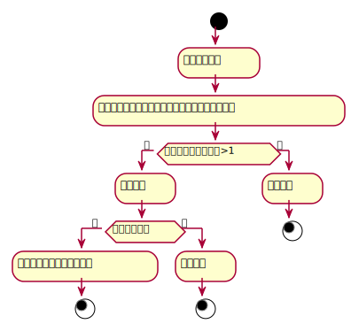
- 通过懒加载查看商品列表：

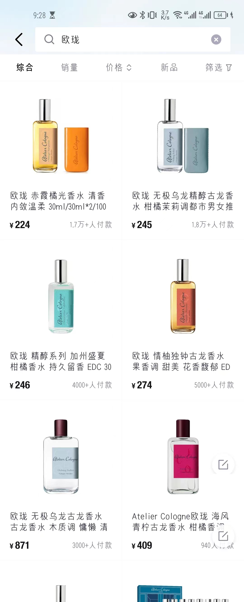

- 点击查看商品详情：

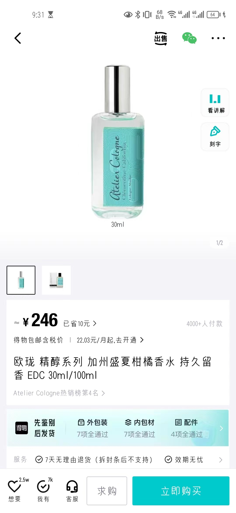

- 商品库存 > 1，进行下单操作：

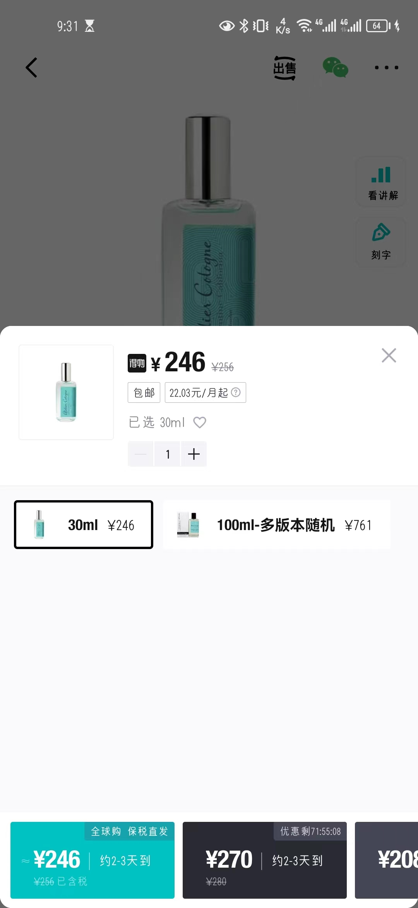

- 生成订单：

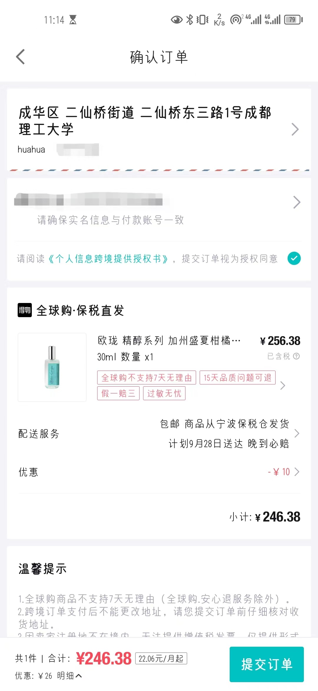

- 接入支付接口，开始付款：

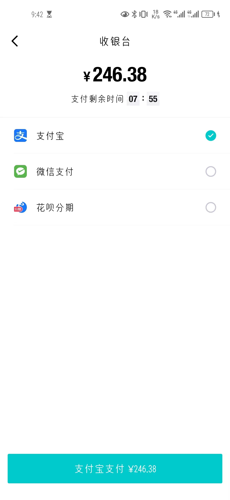

## 技术方案

通过上述项目需求分析，可确定主要涉及以下技术方案：

1. 商品列表需要后端分页返回数据；
2. 商品支付时需要接入支付宝支付接口；
3. 购买成功时需要更新商品信息（库存及付款人数）
4. 使用redis解决并发问题

## 模型关系

分析操作流程：

​       由商品展示列点击进入商品详情页 ——> 选中商品付款 ——> 产生该用户购买商品的订单记录 ——> 调用支付宝支付接口

主要包括商品模块，用户模块，订单模块，支付模块，梳理各个模型之间的关系：


## 商品SPU / 商品详情SKU 模型设计

- model层：

- 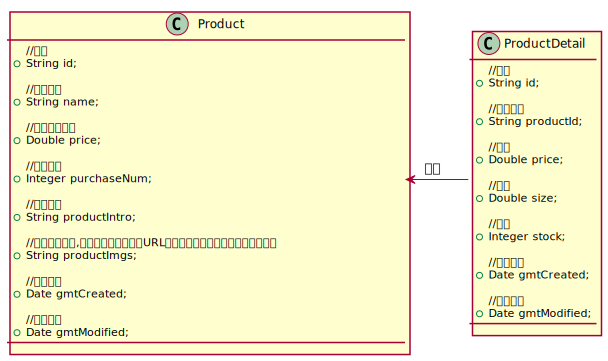
- 相应的数据库模型：

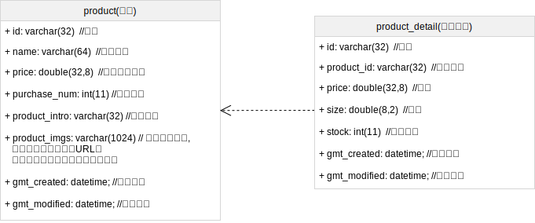

- 导入product .sql、product_detail.sql 初始化测试数据
- 完成DAO以及对应的DAO.xml文件
- 设置前端向后端的自定义对象BasePageParam，处理分页的实现逻辑：

- 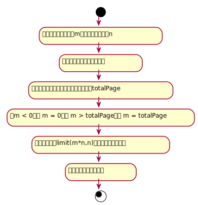
- 设计商品服务接口及实现

- 完成api

## 用户模型设计

## 订单模型设计

参考上图订单页面，订单模型设计主要包括：

1、存储主要信息（用户的信息、商品的信息等）

2、能够从订单信息看出该用户的购买情况

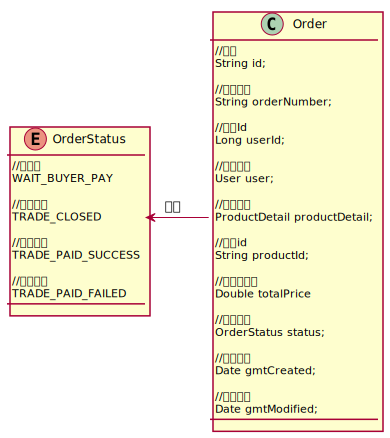

- 下单服务：

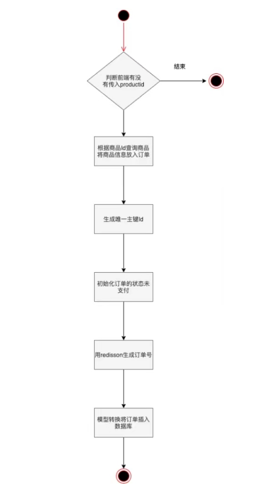

- 订单查询服务：

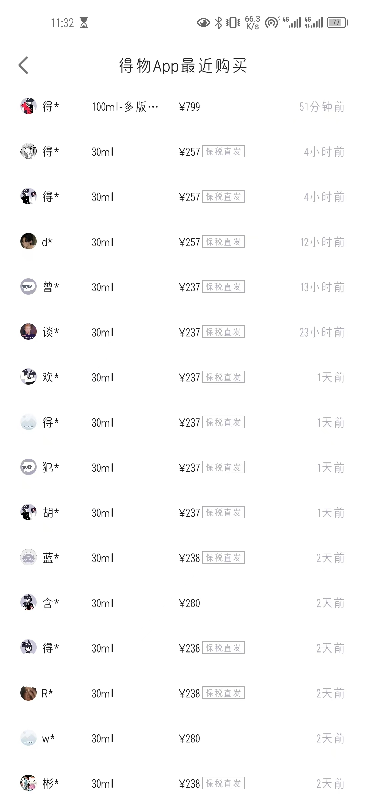

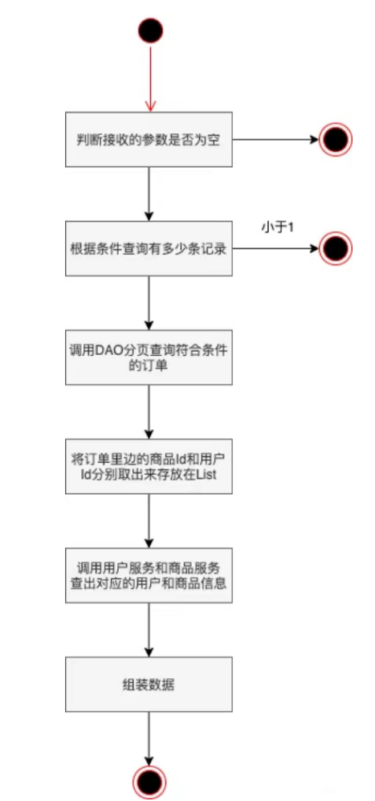

## 支付模型设计

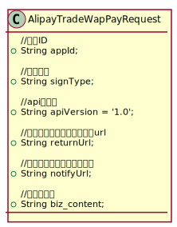

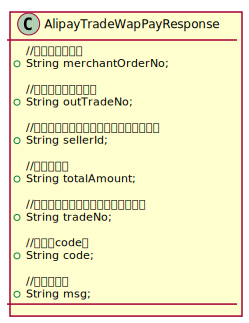

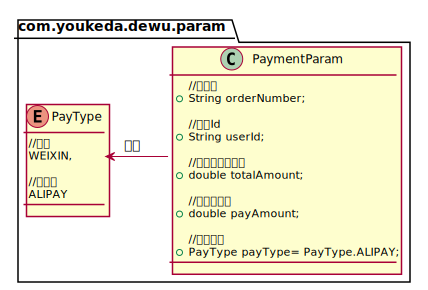

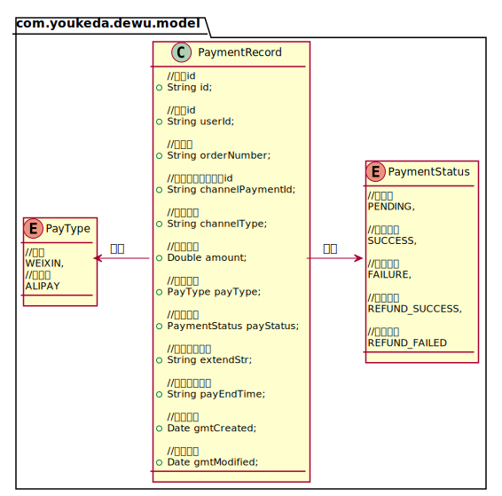

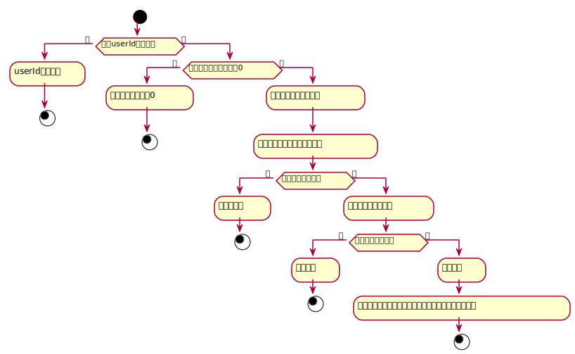

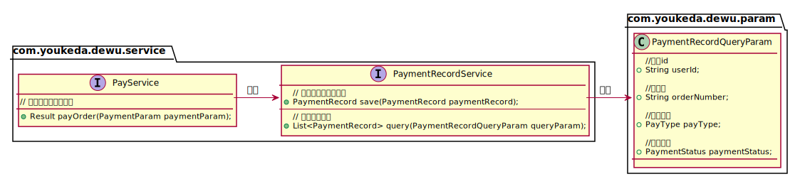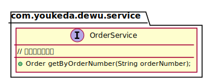

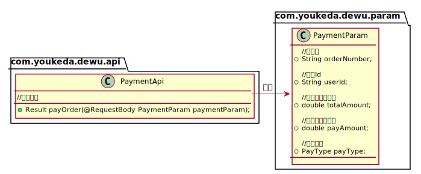

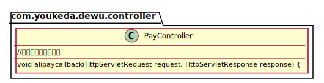

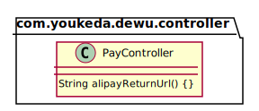

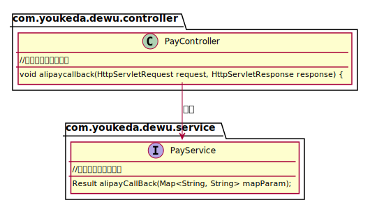

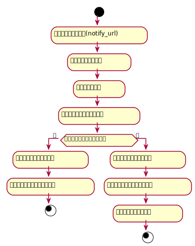

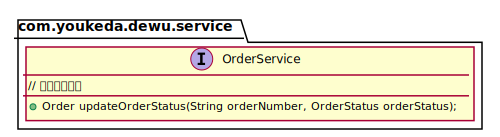

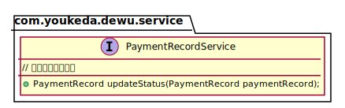

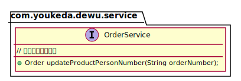

