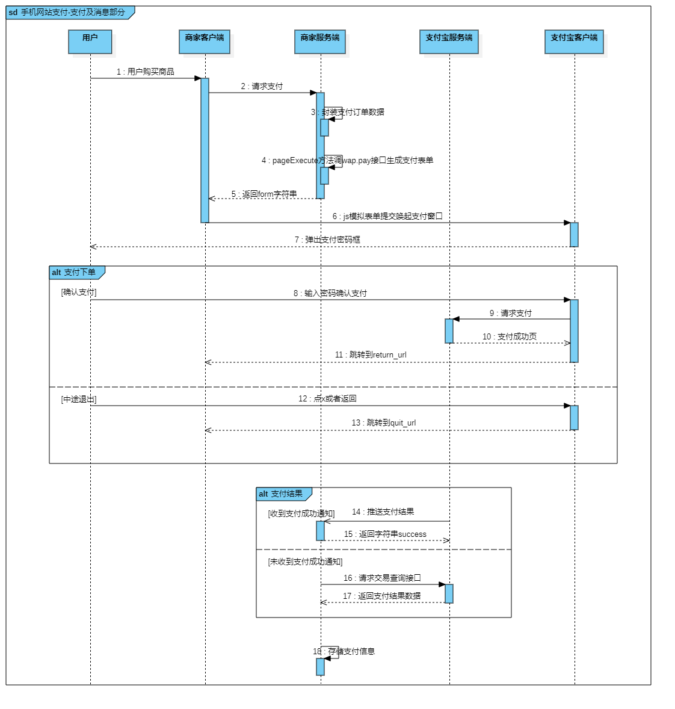
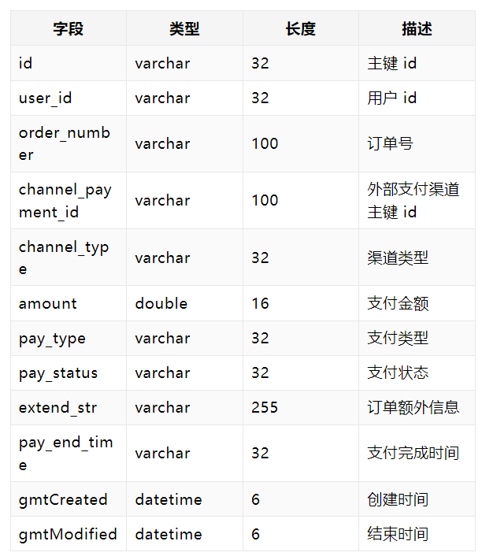

# practice_dewu

> 实战练手项目__类得物电商（部分功能尝试）

## 模块及服务实现

主要完成以下模块及其服务实现：

- 通过懒加载查看商品列表：

- 点击查看商品详情：

- 商品库存 > 1，进行下单操作：

- 生成用户订单：

- 接入支付接口，开始付款：

## 技术方案

通过上述项目需求分析，可确定主要涉及以下技术方案：

1. 商品列表需要后端分页返回数据；
2. 商品支付时需要接入支付宝支付接口；
3. 购买成功时需要更新商品信息（库存及付款人数）
4. 使用redis解决并发问题

## 模型关系

分析操作流程：

​       由商品展示列点击进入商品详情页 ——> 选中商品付款 ——> 产生该用户购买商品的订单记录 ——> 调用支付宝支付接口

主要包括商品模块，用户模块，订单模块，支付模块，梳理出各个模型之间的关系：

## 商品SPU / 商品详情SKU 模型设计

- model层：

- 相应的数据库模型：

- 导入product .sql、product_detail.sql 初始化测试数据
- 完成DAO以及对应的DAO.xml文件
- 设置前端向后端的自定义对象BasePageParam，处理分页的实现逻辑：

- 设计商品服务接口及实现（并根据需求相应地增加dao层服务，且配置mybatis）

- 完成api

## 用户模型设计

- 用户登陆状态判断
- 用户信息获取

## 订单模型设计

参考上图订单页面，订单模型设计主要包括：

1、存储主要信息（用户的信息、商品的信息等）

2、能够从订单信息看出该用户的购买情况

- 下单服务：

  当用户选择好购买的产品后，会生成一条有关该用户的商品订单，或者说是往数据库插入一条购买记录

  

- 订单查询服务：

由页面展示内容可得订单查询服务关联了user表，productDetail表，order表。

具体流程图如下：

## 支付模型设计

参考学习支付宝官方文档https://opendocs.alipay.com/open/203/105285

- 了解学习其支付流程：

根据官方文档https://opendocs.alipay.com/apis/api_1/alipay.trade.wap.pay  了解总结实现支付功能所需要的请求和响应模型：

- 支付宝手机网站支付支付请求的概要模型：

- 支付宝手机网站支付响应的概要模型：

在以上官方设定的基础上完成得物支付相关模型的设计：

- 支付请求模型：

现在大多数支付等功能都基本实现了幂等性，即使多次请求支付接口，最终结果只保留一个，保证了支付结果的正确性。

为方便在后续的排查中有据可查，建立支付流水记录模型。

- 支付流水记录模型：

- 创建支付流水相关的表结构，将支付流水模型数据存入到数据库中进行持久存储。

  

  

  

- 配置支付宝SDK以及实现支付宝支付接口的相关调用

参考官方文档https://opendocs.alipay.com/open/203/105910?pathHash=1a2e3a94

- 得物支付接口的流程图：

- 流程图对应的接口类图：

- 支付接口相关的Service层实现：

- 支付接口API实现：

- 支付成功后支付宝回调流程图：

- 支付回调类图：

- 支付回调接口实现：

- 支付回调后具体的流程图：

- 添加更新订单状态的接口逻辑

- 添加更新支付记录状态的接口逻辑：

- 添加更新商品支付人数的接口逻辑：

